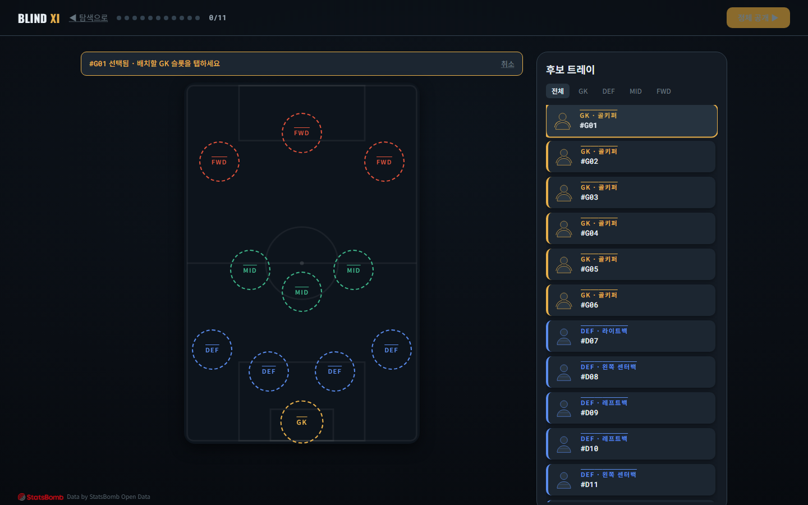

# 블라인드 일레븐 (Blind XI)

**이름을 지웠습니다. 당신의 눈을 믿으세요.**

익명 데이터만으로 월드컵 최고의 11명을 선발하고, 정체 공개 순간 예상 외의 반전을 경험하는 드라마틱한 웹 게임.

[🎮 지금 플레이](https://worldcupmanager.vercel.app)

---

## 게임 화면

| 포메이션 배치 | 정체 공개 |
|---|---|
|  |  |

---

## 게임 소개

### 무엇을 하는가?

당신은 월드컵 감독입니다. 50~60명의 익명 선수들을 데이터(스파이더차트·히트맵·핵심 수치)만으로 판단하여, 당신만의 베스트 11을 완성합니다. 선수의 이름, 국적, 얼굴은 모두 가려집니다.

### 왜 이 방식인가?

편견을 제거한 순수한 데이터 판단을 경험하게 됩니다. 유명한 이름이 아닌 **스탯으로만** 최고의 선수를 고르고, 그들의 정체가 드라마틱하게 공개되는 순간, 당신의 "감독 안목"이 검증됩니다.

### 반전의 재미

- 무명인 줄 알았던 선수가 실제로는 결승 주역
- 유명할 줄 알았던 선수가 예상 외의 선수였음을 발견
- 당신이 뽑은 11명의 실제 월드컵 성적으로 안목 점수 평가

---

## 플레이 방법

1. **대회 선택** — 2018 또는 2022 월드컵 선택 후 "스카우팅 시작"
2. **선수 탐색** — 카드 풀에서 익명 선수 50~60명의 스파이더차트·히트맵 비교
3. **포지션 선발** — 골키퍼·수비수·미드필더·공격수 포지션별로 후보 좁혀가기
4. **포메이션 배치** — 선택한 11명을 클릭(탭)으로 필드에 배치 (포지션 제약 주의)
5. **정체 공개 & 평가** — 당신의 선발 명단이 공개되고 안목 점수 산출

---

## 기술 스택

**프론트엔드**: React 18 · TypeScript · Vite · Zustand · Framer Motion · Tailwind CSS  
**데이터**: StatsBomb Open Data → 빌드 타임 사전 집계 → 정적 JSON (런타임 외부 API 0)  
**배포**: Vercel 정적 호스팅

### 데이터 파이프라인

StatsBomb에서 제공하는 월드컵 이벤트 데이터(슷·패스·히트맵 등 60만+ 이벤트)를 경기 전에 수집하여:
- 각 선수의 출전시간, 슷, 패스, 수비, 활동 영역 집계
- 포지션군 내 백분위 정규화 (공정한 비교 확보)
- 히트맵을 16×10 그리드로 사전 비닝 (번들 경량화)
- 팀 도달 라운드 기반 실제 성적 산출

이 모든 작업은 **배포 전에 완료**되어, 런타임 성능과 안정성을 보장합니다.

---

## 데이터 출처

[StatsBomb Open Data](https://github.com/statsbomb/open-data)

이 프로젝트는 StatsBomb의 공개 데이터를 사용하며, 비상업 해커톤 범위 내에서 다음을 준수합니다:
- StatsBomb 로고·출처 상시 표기
- 선수 사진·팀 로고 미사용
- 비상업적 교육 용도만 허용

---

## 로컬 실행

### 설치 및 개발 서버 실행

```bash
npm install
npm run dev
```

http://localhost:5173에서 게임이 열립니다.

### 데이터 재생성

StatsBomb 원본 데이터를 다시 내려받아 정적 JSON으로 재집계하려면:

```bash
npm run build:data
```

`src/data/` 아래 `players.*.json`과 `meta.json`이 생성됩니다.

### 프로덕션 빌드

```bash
npm run build
```

`dist/` 폴더의 정적 파일들을 배포합니다.

---

## 해커톤 정보

**대회**: DAKER 월간 해커톤 — "내가 축구 감독이라면"  
**제출**: 2026년 8월 3일  
**배포 URL**: https://worldcupmanager.vercel.app  
**GitHub**: https://github.com/ngsk2784-lab/worldcup-blind-eleven

---

## 핵심 설계 원칙

- **편견 제거**: 익명 데이터만으로 순수 판단력 검증
- **감정 곡선**: 진입(30초) → 몰입(카드 탐색) → 결정(배치) → 클라이맥스(정체 공개) → 여운(평가)
- **무설치 경험**: 회원가입·로그인·결제 없음. 링크 클릭 → 즉시 플레이
- **설명 가능한 점수**: 스탯(60%) + 실제 성적(40%) → 신뢰도 높은 평가

---

## 라이선스

이 프로젝트는 비상업 해커톤 전시 목적으로 제작되었습니다. StatsBomb Open Data 라이선스를 준수합니다.
