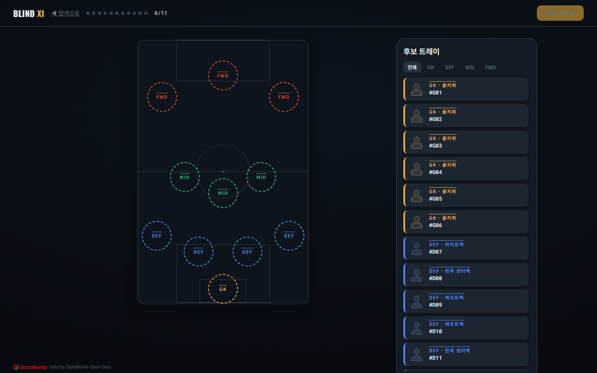
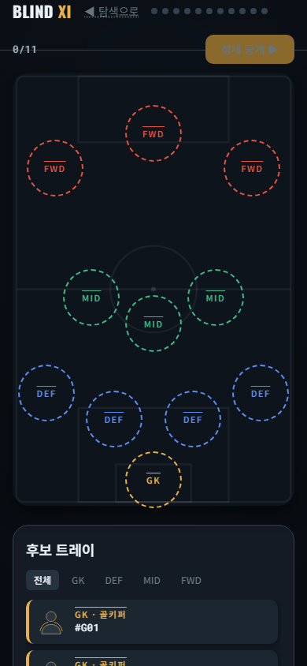
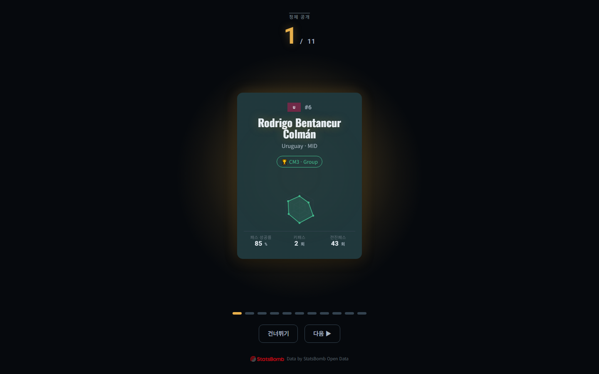

# 블라인드 일레븐(Blind XI)
## 월드컵 감독 해커톤 기획서

---

## 1. 제품 개요

**이름을 지웠습니다. 당신의 눈을 믿으세요.**

실제 월드컵 선수들의 이름·국적을 모두 가린 채, 순수 데이터(스탯·히트맵)만으로 나만의 베스트11을 뽑고, 마지막에 그들의 정체를 마주하는 드라마틱한 웹 경험.

### 핵심 컨셉
당신은 감독이고, 심판관입니다.

편견 없이 **데이터만 보고** 11명을 선발하세요. 각 선수의 스파이더차트(공격·패스·수비·점유 능력), 히트맵(경기 활동 범위), 핵심 수치만 노출됩니다. 이름도, 얼굴도, 팀도 없습니다.

당신이 선택한 11명을 필드에 배치해 라인업을 완성하면, 그 순간 **정체가 하나씩 드라마틱하게 공개**됩니다. 무명인 줄 알았던 선수가 실제로는 레전드, 스타였고, 당신이 생각한 그 스타는 의외의 인물이었다는 반전.

그 후 당신의 "안목"을 점수로 평가받습니다. 실제 월드컵에서 당신이 뽑은 선수들이 어떤 성적을 거두었는지 대조하며, 자신의 눈이 얼마나 정확했는지 확인하는 여운.

---

## 2. 왜 이 컨셉이 참신한가?

### 대회 예시와의 차별화

대회가 제시한 4가지 예시 중 어느 것도 **"익명 데이터 판단 → 정체 반전"** 구조를 담지 않습니다.

| 예시 | 접근 | 블라인드 일레븐과의 차이 |
|---|---|---|
| 전술 보드 드래그 | 실명 선수를 위치에 배치 | **편견이 개입** → 드래그만 신선함 |
| AI 추천 서비스 | AI가 데이터로 감독 어시스트 | **능동성 결여** → 심사위원이 수동 |
| 경기 시뮬레이션 | "내가 감독이었다면" 가정 | **실시간 엔진 개발 리스크 높음** |
| 교체·지시 | 리플레이 중 타이밍 조작 | **편견 기반 선택**, 시간 압박 |

**블라인드 일레븐**: 모든 선입견을 제거한 순수 데이터 판단 + 반전의 감정 충격 → **심사위원이 처음 경험하는 게임 구조**

---

## 3. 사용자 경험 여정

### 감정 곡선 (진입 → 몰입 → 클라이맥스 → 여운)

#### S0. 진입 (Hook)
**감정: 호기심 · 도전 의식**

화면에 몇 장의 익명 카드가 나타납니다. 각 카드는 이름도 국적도 없이 **실루엣 도형 + 스파이더차트 + 핵심 수치만** 표시됩니다.

"이름을 지웠습니다. 당신의 눈을 믿으세요." — 이 선언이 심사위원에게 명확한 목적을 각인합니다.

**30초 내에 체감**: 무엇을 하는 게임인지 즉시 이해하고, 대회(2018/2022) 선택 후 "스카우팅 시작" 클릭으로 코어 루프 진입.

---

#### S1. 선수 카드 탐색 (Flow)
**감정: 몰입 · 고뇌**

카드 풀에서 50~60명의 익명 선수를 보며 탐색합니다. 각 카드는 **포지션군(GK/수비/미드필더/공격수) + 스파이더 6축 + 히트맵**을 표시합니다.

- **스파이더차트**: 공격력·패스 능력·수비력·점유력·리더십·신뢰도를 포지션군 내 백분위로 표현 (공정한 비교)
- **히트맵**: 경기 중 선수가 주로 활동한 공간을 시각화 → "어느 위치에서 주로 뛰는가"를 직관적으로 파악
- **핵심 수치**: 출전 분, 슛 수, 패스 성공률, 태클 등 필수 스탯만 노출

카드를 클릭하면 상세 뷰로 넘어가고, 2장 이상을 나란히 비교할 수 있습니다.

**포지션별로 후보를 좁혀가며**, 당신의 11명의 앞뒷장이 점차 명확해집니다.

---

#### S2 · S3. 포메이션 배치 & 확정 (Commitment)
**감정: 고민 · 결정의 무게**

필드 위 11개의 슬롯에 카드를 **드래그로 배치**합니다.

- **포지션 제약**: 골키퍼 1명 필수, 수비수·미드필더·공격수 간 라인별 정원 제약
- **실시간 피드백**: 빈 슬롯, 포지션 미스매치를 시각적으로 표시해 "감독의 고뇌" 연출
- **조작 직관성**: 드래그의 촉각 피드백, 스냅(정렬), 유효 슬롯 하이라이트 → 심사위원이 "감독의 손맛"을 느낌

11칸이 규칙대로 채워지면 "정체 공개" 버튼이 활성화됩니다. 확정 직전의 순간, 짧은 긴장:

**"지금부터 돌이킬 수 없습니다."**

---

#### S4. 정체 공개 (Climax)
**감정: 긴장 → 반전 → 카타르시스**

**이것이 제품의 심장입니다.**

당신이 배치한 11명의 정체가 **하나씩 순차적으로** 드라마틱하게 공개됩니다.

각 카드가 순차적으로 뒤집혀 **실명·국적·실제 능력·팀 성적**이 드러납니다. 페이싱·페이드·스태거 애니메이션으로 각 반전에 정서적 무게를 부여합니다.

- **무명인 줄 알았는데 레전드?** → 능력은 낮게 보였지만 실제로는 우승팀 주역
- **스타인 줄 알았는데 의외의 선수?** → 유명한 이름이 아니었지만 스탯은 압도적

이 순간의 충격과 웃음, 자기반성이 **감동 배점의 핵심**.

---

#### S5. 결과 & 여운 (Resonance)
**감정: 만족 · 자기확인 · 재도전 욕구**

정체 공개가 끝나면, 당신의 "안목 점수"가 산출됩니다.

- **점수 = 0.6 × 스탯 우수도 + 0.4 × 실제 대회 성적** (A/B/C/D 등급으로 표시)
  - 데이터만 보고 판단한 당신의 안목이 얼마나 정확했는가?
  - 실제 월드컵에서는 어떤 결과를 거두었는가?
  
- **서사 강조**
  - "가장 의외의 픽": 무명으로 보였지만 실제로는 결승 주역
  - "최고의 픽": 스탯·성적 모두 우수한 당신의 정확한 안목
  
- **공유 카드**: 내 XI + 안목 점수를 이미지로 생성해 SNS 공유

**"다시 하기"** 버튼으로 즉시 다른 대회/새로운 풀에 재진입 → 무한 리플레이 훅.

---

## 4. 핵심 메카닉 (게임플레이)

### M1. 익명 카드 시스템
- **실명·국적·사진 없음**: 실루엣 + 익명ID만 표시
- **스파이더 6축**: 공격·패스·수비·점유·리더십·신뢰도 (포지션군 내 백분위)
- **히트맵**: 16×10 그리드, 경기 중 활동 위치 밀도 시각화
- **핵심 수치**: 출전분, 득점, 패스 성공률, 태클 등 필수만

### M2. 포메이션 제약 드래그
- 11칸 필드, 포지션별 정원 제약
- GK 1명 필수, 수비/미드/공격 라인 균형
- 드래그로 직관적 배치, 실시간 유효성 피드백

### M3. 정체 공개 연출
- **순차 공개**: 한 번에 다 까지 않고 1명씩 스태거링
- **반전 강조**: 익명 인상과 실명 사이의 갭을 시각적으로 극대화
- **페이싱 조절**: 클라이맥스의 긴장과 이완을 감정으로 조종

### M4. 안목 점수
- **데이터 기반**: 스탯 우수도 0.6 + 실제 성적 0.4 (설명 가능)
- **신뢰성**: 임의값 없음, 모든 값은 StatsBomb 집계 사실
- **서사**: 가장 의외의 픽 강조로 드라마 연장

### M5. 무설치·무가입 심사 경험
- 배포 URL 링크만으로 즉시 플레이
- 회원가입 / 로그인 / 결제 / 외부 API 키 불필요
- StatsBomb 출처표기 상시 노출 (라이선스 준수)

---

## 5. 데이터: StatsBomb Open Data

### 출처 및 규모
- **데이터**: FIFA 남자 월드컵 **2018 · 2022**, StatsBomb Open Data (GitHub, 무료 JSON)
- **단위**: 이벤트 기반 (슷·패스·xG·드리블·태클 등 60만+ 이벤트)
- **큐레이션**: 대회당 **50~60명** (GK/수비/미드/공격 포지션별 균형 배분)
  - 최소 출전 기준(예: 180분) 이상의 선수만 포함 → 신뢰도 확보
  - 탐색 피로 ↔ 다양성 균형

### 집계 지표 (카드에 노출되는 값들)

| 영역 | 지표 | 계산 방식 |
|---|---|---|
| **공격** | 슷 수, 득점, xG, 슷 정확도 | raw 이벤트에서 type=shot으로 집계 |
| **패스** | 패스 성공률, 키패스, 전진패스, xA | 패스 이벤트 누적, 정규화 |
| **수비** | 태클, 인터셉트, 볼 리커버리, 압박 | 수비 관련 이벤트 카운팅 |
| **공간** | 히트맵, 평균 포지션 | 이벤트 location을 16×10 그리드에 비닝 |
| **신뢰도** | 출전 분 | 매치 lineups positions from/to 합산 |

### 라이선스 준수
- StatsBomb Attribution 상시 노출 (푸터 / 정보 페이지)
- 비상업 해커톤 범위 내 사용 명시
- **선수 사진·팀 로고 미사용** (IP 리스크 회피, 컨셉상 익명성 강화)
- 실명과 실제 스탯만 데이터로 제공

---

## 6. 심사 기준 대응 전략

### 참신성 (30점)

**기획 아이디어 자체의 창의성**

- ✅ 대회 예시 4종("전술 보드 / AI 추천 / 경기 시뮬 / 교체 지시") 중 **어디에도 없는 접근**
- ✅ **편견 제거(익명) + 데이터 판단 + 정체 반전** 의 삼각구조는 심사위원이 처음 마주하는 게임 메커닉
- ✅ "감독의 안목" 시험이라는 메타포 → 심사위원 본인의 판단을 게임으로 검증

**대응**: 기획서에서 "왜 이 컨셉이 참신한가?" 섹션을 예시와 직접 비교하여 설득력 강화.

---

### 감동 경험 설계 (25점)

**"내가 감독이다"는 몰입감 + 조작의 직관성**

- ✅ **Hook(30초)**: "이름을 지웠습니다" 선언으로 즉시 목적 각인, 심사위원의 호기심 착화
- ✅ **Flow(카드 탐색 + 배치)**: 
  - 데이터 비교 퍼즐로 고뇌하는 감독의 심리 재현
  - 드래그의 촉각 피드백으로 "직접 조작" 감각
  - 포지션 제약이 "이 선수는 쓸 수 없다"는 감독의 고뇌 생성
- ✅ **Climax(정체 공개)**: 
  - 순차 공개로 각 반전에 정서적 무게
  - 페이싱·애니메이션으로 감정 극대화
  - 심사위원이 "오오!"라고 탄성하는 순간 필수
- ✅ **Resonance(여운)**: 
  - 점수로 자기 판단 검증
  - 실제 성적과 대조로 스토리 완성
  - 즉시 재도전 버튼으로 리플레이 욕구 유발

**대응**: UI/UX 스크린샷으로 각 단계의 감정 곡선을 시각적으로 입증. 정체 공개 애니메이션 스크린 캡처 포함.

---

### 완성도 (25점)

**동적 기능이 실제로 작동하며 오류 없이 안정적으로**

- ✅ **실시간 엔진 부재** → 런타임 리스크 극히 낮음
  - 모든 게임 데이터(선수 스탯·히트맵·점수)는 **빌드 타임에 사전 집계**
  - 배포 후 런타임은 정적 JSON 렌더링만 → 버그 가능성 최소
- ✅ **MUST 기능에만 집중** → 3주 내 완결 보장
  - M1~M5만 완성하면 심사 완주 가능한 완결된 경험
  - SHOULD(복수 포메이션 / 음향 / 리더보드)는 선택사항 → scope 통제
- ✅ **테스트 전략**
  - 데이터 집계: 알려진 선수(Messi/Mbappé)로 정합성 sanity check
  - 포메이션: 포지션 제약 검증 자동화
  - 애니메이션: 11명 동시 렌더에서 60fps 목표 (Framer Motion 최적화)
- ✅ **배포 안정성**
  - Vercel 무료 호스팅 (SPA 정적 배포, 가동률 99.95%)
  - 데이터는 로컬 JSON (외부 API 호출 0)

**대응**: 기술 스택(React/TypeScript/Framer Motion)의 안정성·검증된 조합이라는 점 강조. 3주 일정 내에 완결 가능한 minimal viable product 설계임을 명시.

---

### 기획 · 구현 일관성 (20점)

**기획 의도와 실제 구현이 1:1로 대응되는가**

- ✅ **"데이터로만 판단"이라는 기획** → **익명 카드가 실명·국적 없음**으로 구현
- ✅ **"포지션 제약이 감독의 고뇌"라는 기획** → **드래그 시 라인별 정원 제약 UI로 구현**
- ✅ **"정체 반전이 감동의 핵심"이라는 기획** → **순차 공개 애니메이션 + 반전 강조**로 구현
- ✅ **"데이터 기반 안목 점수"라는 기획** → **0.6 스탯 + 0.4 성적으로 설명 가능하게 구현**

각 기능이 단순히 "예쁜 UI"가 아니라, **기획 의도의 직접적 구현**이라는 점을 강조.

**대응**: 기획서 섹션별로 "이를 구현하는 메카닉" 항을 명시해 대응 관계를 추적 가능하게 함.

---

## 7. 기술 스택 & 완성도 보증

### 스택 개요

| 계층 | 선택 | 이유 |
|---|---|---|
| **프레임워크** | React 18 + Vite | 정적 SPA 최적, 빠른 빌드, Vercel 직행 |
| **언어** | TypeScript | 데이터 스키마를 타입으로 강제 → 병렬 팀 간 계약 확보 |
| **상태관리** | Zustand | 단순·보일러플레이트 최소, 드래그 중 리렌더 제어 용이 |
| **드래그** | @dnd-kit | 터치 지원(노트북/태블릿), 접근성, 스냅/고스트 내장 |
| **애니메이션** | Framer Motion | 정체 공개 순차 연출에 최적 (stagger + flip) |
| **스파이더차트** | 직접 SVG | 라이브러리 의존 제거, 번들 경량, 커스텀 자유 |
| **히트맵** | 사전 비닝 그리드 + SVG | 런타임 연산 0, 16×10 rect 색칠만 (성능 확보) |
| **배포** | Vercel 정적 호스팅 | 무료, 99.95% 가동률, PR 프리뷰 URL 자동 |

### 무설치·무가입·무결제 보증
- ✅ 배포 URL 링크만으로 즉시 플레이 가능
- ✅ 회원가입 / 로그인 불필요
- ✅ 결제 기능 없음
- ✅ 외부 API 키 불필요 (StatsBomb은 사전 집계해 번들)
- ✅ 심사자가 별도 환경 설정 없이 "링크 → 플레이 → 완주"만으로 평가 가능

### 보안 & 지적재산권
- ✅ 취약점 = 0 (정적 SPA, DB 없음, 사용자 입력 최소)
- ✅ 선수 사진·팀 로고 미사용 (IP 리스크 회피)
- ✅ StatsBomb 출처표기 상시 노출 (라이선스 준수)
- ✅ 실명은 공개 사실 (비하 표현 불포함)

---

## 8. 팀 & 개발 프로세스

**팀**: 풀스택 개발자 + UI/UX 디자이너 + QA(검증) 3명의 AI 협력팀  
**일정**: 3주 (기획서 마감 7/27, 최종 산출물 8/3)

**프로세스**: 
1. 데이터 파이프라인 (StatsBomb raw → 사전 집계 정적 JSON) 병렬 진행
2. 게임 UI·인터랙션 개발 (선행 스키마 계약으로 3개 트리 병렬 가능)
3. 정체 공개 연출·결과 기능 (Framer Motion 애니메이션 중심)
4. 품질 루프: 테스트(데이터 정합성, 포메이션 제약, 애니메이션 성능) → UI 검수(심사위원 관점) → 보안 감사(IP·취약점) → 배포

---

## 9. 배포 및 심사 정보

**배포 URL**: https://worldcupmanager.vercel.app  
**GitHub 저장소**: https://github.com/ngsk2784-lab/worldcup-blind-eleven  
**기술 문서**: `docs/architecture.md` / `docs/data-schema.md`

---

## 결론

**블라인드 일레븐**은 단순한 "감독 게임"이 아닙니다.  
편견을 벗기는 게임입니다.

심사위원이 링크를 열고 30초 안에 목적을 체감하고, 3~5분간의 데이터 판단 → 배치 → 정체 공개 → 평가라는 **완결된 감정 곡선**을 완주합니다.

정체 공개의 순간, "오, 이 선수가 저런 선수였어?"라는 반전과 웃음, 그리고 "내 안목이 맞았다 / 틀렸다"라는 자기 검증의 쾌감.

이것이 **심사 기준 4개(참신성·감동·완성도·일관성)를 정면으로 공략하는** 기획입니다.

---

*기획서 작성: 2026-07-07*  
*대회: DAKER 월간 해커톤 "내가 축구 감독이라면"*  
*마감: 기획서 제출 2026-07-27 10:00 KST / 최종 산출물 제출 2026-08-03 10:00 KST*
